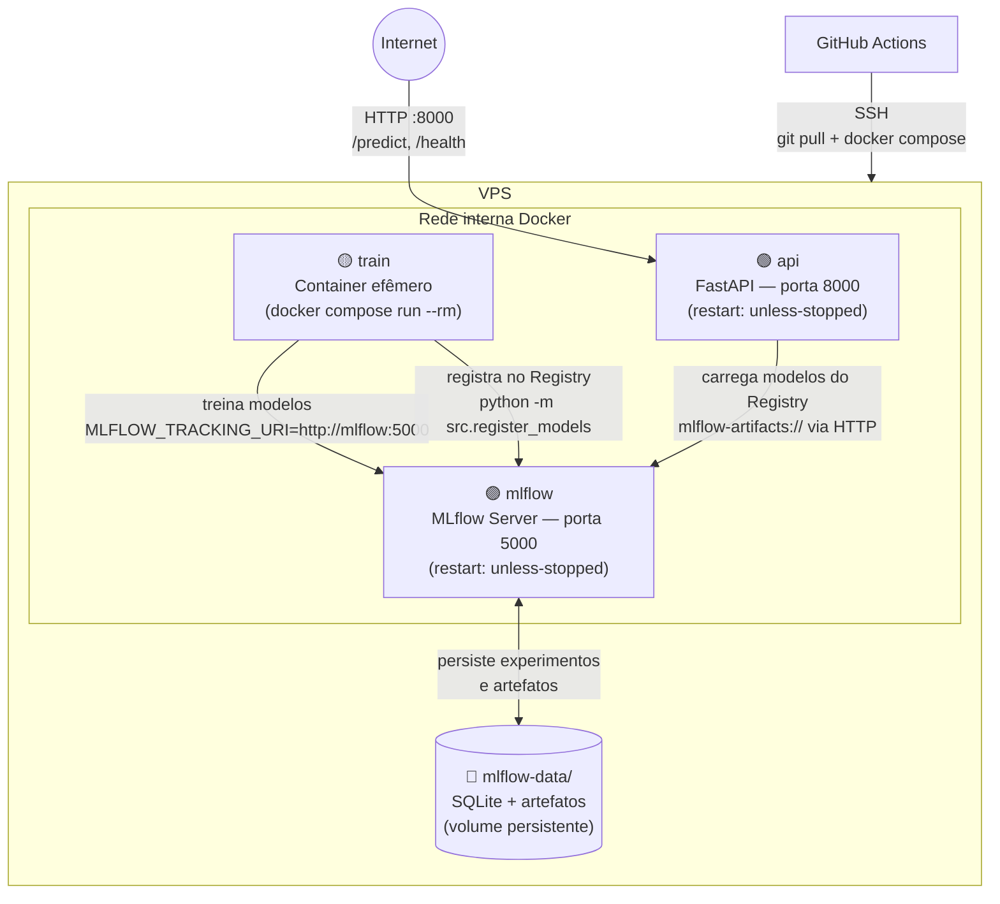

# Architecture — Churn Prediction System

## 1. Visão Geral

Este documento descreve a arquitetura do sistema de previsão de churn, cobrindo o fluxo completo desde os dados até a inferência via API.

O projeto segue uma abordagem modular, separando claramente:

* Processamento de dados
* Treinamento de modelos
* Registro e promoção de modelos
* Serviço de inferência (API)
* Pipeline CI/CD

---

## 2. Fluxo do Sistema

### Ambiente local

```
Dados Brutos (data/raw)
        ↓
Dados Processados (data/processed)
        ↓
Treinamento (make train)
  ├── train_baselines.py → Logística + Dummy
  └── train_mlp.py       → MLP + Preprocessor
        ↓
MLflow local (mlflow.db + mlruns/)
        ↓
Serviço de Inferência (src/api/)
        ↓
Endpoint /predict — lê .pkl de src/models/
```

### Ambiente de produção (VPS)

```
git push → merge na main
        ↓
GitHub Actions
  ├── lint + testes
  ├── docker compose run train          → treina dentro do container, loga no MLflow da VPS
  ├── docker compose run train register → promove no MLflow Registry se melhor
  └── docker compose up --build api     → reconstrói e reinicia o container da API
        ↓
API FastAPI (porta 8000)
        ↓
Endpoint /predict — carrega modelos do MLflow Registry
```

---

## 3. Componentes do Sistema

### Data Layer

* `data/raw/` → dados originais
* `data/processed/` → dados tratados e prontos para modelagem

---

### Model Layer

| Arquivo | Responsabilidade |
|---|---|
| `src/model.py` | Arquitetura da rede neural MLP (ChurnMLP) |
| `src/train_baselines.py` | Treina Logística e Dummy; loga no MLflow |
| `src/train_mlp.py` | Treina a MLP e o preprocessor; loga no MLflow |
| `src/early_stopping.py` | Interrompe o treino quando a validação para de melhorar |
| `src/pipeline.py` | ColumnTransformer com StandardScaler (sem data leakage) |
| `src/utils.py` | Utilitários: `set_seed`, `find_best_threshold`, `setup_mlflow` |

---

### Model Management

| Arquivo | Responsabilidade |
|---|---|
| `src/register_models.py` | Compara métricas com a versão em Production e promove no MLflow Registry se melhor |

Nomes dos modelos no MLflow Registry:

| Nome no Registry | Modelo |
|---|---|
| `ChurnLogistic` | Regressão Logística |
| `ChurnDummy` | DummyClassifier |
| `ChurnMLP` | Rede neural MLP PyTorch |
| `ChurnPreprocessor` | StandardScaler (versionado junto com a MLP) |

---

### API Layer

Local: `src/api/`

Responsável por:

* Servir o modelo em produção
* Receber requisições externas
* Retornar previsões

| Arquivo | Responsabilidade |
|---|---|
| `main.py` | Inicialização do FastAPI e middleware de latência |
| `routes.py` | Endpoints: `GET /health`, `POST /predict` |
| `schemas.py` | Validação de entrada com Pydantic (CustomerData) |
| `services/model_service.py` | Carrega modelos e executa inferência |
| `core/logger.py` | Logger estruturado (timestamp \| nível \| módulo) |

O `model_service.py` alterna o comportamento pela variável `ENVIRONMENT`:
* `local` (padrão) → carrega `.pkl` do disco
* `production` → carrega do MLflow Registry via `MLFLOW_TRACKING_URI`

---

### CI/CD Layer

Arquivo: `.github/workflows/ci-cd.yml`

| Job | Quando roda | O que faz |
|---|---|---|
| `ci` | Todo PR e push | lint (ruff) + testes (pytest) |
| `deploy` | Merge na main | SSH na VPS → treino → registro → restart da API |

---

## 4. Infraestrutura Docker

| Arquivo | Uso |
|---|---|
| `docker-compose.yml` | Desenvolvimento local (api + mlflow + train) |
| `docker-compose.prod.yml` | VPS em produção (api + mlflow persistente) |
| `Dockerfile` | Imagem base usada por ambos os composes |

### Diagrama da VPS em produção



> O container `train` é criado pelo pipeline CI/CD, executa o treino e o registro, e é removido automaticamente (`--rm`). Os containers `api` e `mlflow` ficam permanentemente em execução com `restart: unless-stopped`.

---

## 5. Padrões de Projeto Utilizados

* **Separação de responsabilidades** — data, model, registry, API e CI/CD em camadas distintas
* **Extract Function** — `train_mlp.py` dividido em 7 funções com responsabilidade única
* **Extract Module** — `set_seed`, `find_best_threshold` e `setup_mlflow` em `utils.py`
* **Service Layer** — `model_service.py` isola a lógica de inferência das rotas
* **Environment-based configuration** — variável `ENVIRONMENT` define comportamento local vs produção

---

## 6. Considerações Finais

A arquitetura foi projetada para:

* Facilitar manutenção e evolução do código
* Garantir reprodutibilidade via seeds fixas e pipeline sklearn
* Suportar operação em produção real com MLflow Registry e CI/CD automatizado
